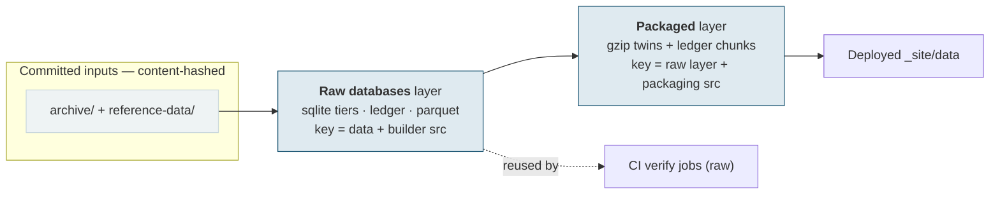
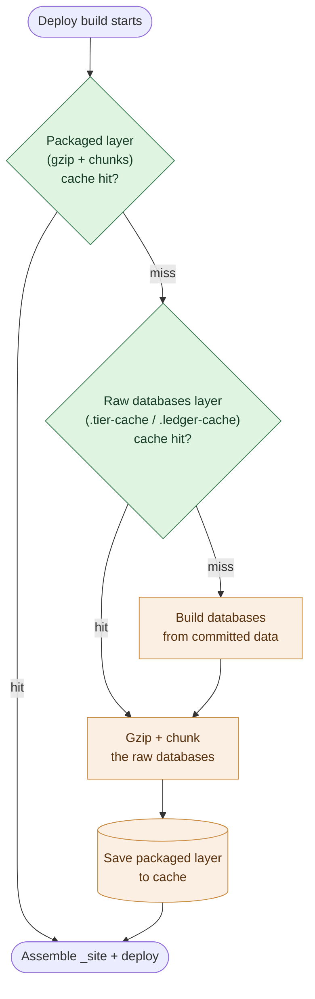

# ADR 0019 — Layered, content-addressed build cache and a unified CI/CD pipeline

- Status: accepted
- Date: 2026-07-14
- Related: ADR 0002 (repository write controls), ADR 0003 (in-repo presentation / Pages deploy), ADR 0012 (supply-chain posture); issues #478 (CI performance), #497 (post-deploy verification), #499 (loading affordance); PRs #507 (smoke-test exit), #513 (deploy database cache)

## Context

The query databases are a **deploy artefact, derived fresh** and never committed — SQLite is not byte-deterministic, so it lives outside the golden-master lane (ADR 0003, ADR 0010). Building them is expensive: the ~1 GB master database, the per-dataset tiers, and the full compact claim-ledger fold together take **~22 minutes** in the Pages build job (measured: #513's first deploy, 12:52→13:14 UTC).

Until #513 that cost was paid on **every** deploy, including deploys that changed only the site (HTML/JS/CSS) — where the databases are byte-for-byte determined by *unchanged* inputs. The recent #499 affordance rollout was five consecutive site-only deploys, each rebuilding a 1 GB database that had not changed.

The #478 CI-performance campaign already established the principle for the *verification* side: an `actions/cache` over the two expensive builds (the claims Parquet and the raw SQLite tiers), keyed by **input closure** (the committed data + the builder source + `.nvmrc` + the pinned DuckDB action), so most PRs — which touch neither the data nor the builders — skip the build and only run the consuming tests. #478 also drew the **build-vs-publish split**: CI verifies *raw* databases (`compress: false`), and gzip/chunking is a *publish* concern the deploy owns. At the time the two workflows were kept deliberately separate so the verify cache could not be *accidentally* shared with the deploy (whose output — compressed — differs).

This ADR extends that same content-addressed, layered-cache principle to the **publish** side, and — having found a genuine reason to share layers between verify and deploy — reverses the "keep the workflows separate" stance in favour of a single pipeline.

### Constraints that shaped the design

Three properties of the available mechanisms are load-bearing and were verified against current GitHub documentation:

1. **A cache key must be content-addressed on the input files, never a git commit.** Merging a PR creates a *merge commit* whose SHA differs from the commit the PR's checks ran on, so a commit-keyed cache could never match across the PR→main boundary. A `hashFiles(...)` key over the input closure is stable whenever the inputs are.
2. **`actions/cache` is branch-scoped.** A run on `main` cannot restore a cache created by a PR/feature run (a PR cache is scoped to its merge ref and only re-restorable by re-runs of that PR); feature runs *can* read the default-branch cache, but not vice-versa. So content-keying lets a **main run reuse a *prior main* run's layers** — which is exactly the common (site-only) case — but does **not** let `main` reuse what the *PR* just built.
3. **The cache is a bounded, self-managing resource.** 10 GB per repository, evicted **least-recently-*accessed* first** and after 7 days unused. The layers we depend on are hit on every push, so they stay warm; stale merged-PR cache copies age out on their own. No proactive hygiene is required.

## Decision

**1. Model the deploy build as content-addressed layers**, each keyed on its own input closure (the committed data plus the source of the builders that produce that layer), mirroring the #478 verify caches:

**2. The deploy walks *down* the layers and rebuilds only what is missing above the lowest hit** — the "stepped" cache, in the spirit of Docker / incremental Maven–Gradle builds:

- **Packaged hit** (the common site-only deploy): restore the gzipped + chunked databases and deploy. No build, no compression.
- **Packaged miss, raw hit** (a packaging-code change, or the deploy racing a fresh data build): reuse the raw databases **already built by CI** (`.tier-cache` / `.ledger-cache`) and only gzip + chunk them — no second SQL construction.
- **Both miss** (a data change, first time on `main`): rebuild the raw layer from the committed data, then package.

Reusing CI's raw layer means the databases are constructed **once** per input closure, and the deploy's own cache holds only the *incremental* compressed artefacts — so it stops duplicating the ~1 GB raw master across the CI and deploy caches, which also **relieves the 10 GB cache pressure**.

**3. Unify `ci.yml` and `pages.yml` into one `cicd.yaml`.** The reuse itself comes from the content-addressed cache and needs no merge — but the deploy sharing CI's layer *keys and layout* (step 2 above) is fragile across two files (change a key in one, silently break the other). One workflow defines the layer keys **once** and shares them safely. The deploy and post-deploy jobs are gated `if: github.ref == 'refs/heads/main'`, so PR runs execute build + verify (now including the deploy-database build, giving it **pre-merge coverage** it never had) and stop before deploying. **Permissions stay job-scoped**: verify jobs are `contents: read`; only the `deploy` job holds `pages: write` + `id-token: write`, preserving the read-only-CI posture of ADR 0012 at the job level.

**4. The store is `actions/cache`.** Content-keyed, ephemeral (zero repository impact), self-managing. We accept its branch-scope limit: `main` reuses prior-`main` layers (the common case), and a data change rebuilds only its changed-and-above layers once, post-merge.

**5. GitHub Releases are the escalation, not the starting point.** If we later need genuine build-once *across* the PR→main boundary for data changes, or the cache proves insufficient, a Release asset keyed on the input-closure hash is the durable, branch-agnostic store. Crucially, **release assets are not in the git object database** — they do not bloat clones or history and delete cleanly — so they do not incur the costs that rule out committing artefacts (below). The trade to weigh is the `contents: write` permission it requires against the ADR 0012 posture, plus find-or-create-by-hash machinery and a 2 GiB per-asset limit (the master is ~1 GB and growing).

### Alternatives considered and rejected

- **Committing the built artefacts to git** (the tree, an orphan/data branch, or Git-LFS): rejected. Binary artefacts bloat every clone and pack poorly, the bytes persist in history forever unless purged by a destructive rewrite, and LFS keeps a pointer in history while adding its own storage/bandwidth billing. This was previously declined and remains so.
- **Cross-workflow artifact download** (deploy pulls CI's uploaded artifact): rejected as fragile — it needs the producing run's id and a token, artifacts are immutable and expire (90-day default), and matching across the PR→merge-commit boundary is awkward.
- **Git-commit cache keys**: rejected — the merge commit differs from the PR commit, so they can never match across the boundary (constraint 1).

## Consequences

- A **site-only deploy skips the ~22 min database build** (restore + assemble only). Measured on #513: the build job fell from **~22 min** (cache miss, full build) to **~3 min** (cache hit) — the residual being the always-run site assembly (dataset pages, nav, size stamping), not the databases. Data and builder changes rebuild correctly, but only the affected layers.
- The **databases are constructed once** per input closure (in CI's verify layer, reused by deploy) rather than built separately for verify and publish.
- The **deploy build gains pre-merge coverage** — a change that breaks the packaging step is caught on the PR, not after merge (it previously only ran on `main`).
- The deploy cache holds only the incremental compressed layer, **reducing cache footprint** and easing the 10 GB ceiling.
- This **reverses the "workflows stay separate"** stance recorded during #478 — which existed to prevent *accidental* cache sharing. We now share *deliberately*, in one file, with the keys co-located.
- The read-only-CI posture (ADR 0012) is preserved via **job-level permissions**, not workflow-level isolation — a reviewer must read the job permissions, not the file boundary, to confirm the verify path cannot write.
- **Implementation is incremental.** Shipped: #507 (smoke-test prompt exit), #513 (the deploy packaged-layer cache), #516 (the `cicd.yaml` unification — `ci.yml` + `pages.yml` merged into one file, deploy gated on `main`, verified live), and #517 (keying the build caches on a test-excluding closure hash, so a test-only change no longer rebuilds the corpus). Remaining: the **raw-layer reuse** — the walk-down's middle step, where the deploy restores CI's raw `.tier-cache` and only gzips/chunks it instead of rebuilding the databases. That, and any finer per-stage key scoping, are the deferred refinements, to land as their own PRs against this ADR.
