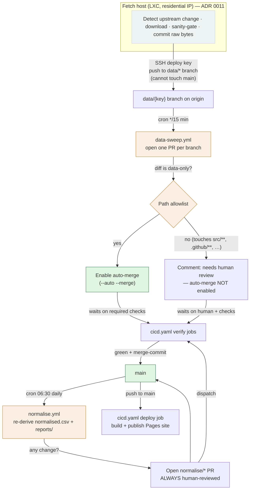

# Data flow and stage-gates

How data enters this repository and what checks stand between a new byte and
`main`. This is the single end-to-end map of the pipeline: for each stage it
names the **trigger**, the **gate** that must pass, the **ADR** that governs it,
and whether a **human is in the loop**.

It describes what the workflows in `.github/workflows/` actually do, which is
not always identical to what the ADRs intend — where the two differ, this page
says so. Contributors adding a dataset should read
[`adding-a-dataset.md`](adding-a-dataset.md) for the how-to; this page is the
why-and-where-it-is-gated companion.

## Two kinds of enforcement

The gates fall into two groups, and the distinction matters when reading this
page:

- **In-repo, code-verifiable.** The workflow YAML and the scripts it runs are in
  this repository and can be audited directly. Everything with a `.github/…`
  citation below is of this kind.
- **GitHub-settings-enforced.** Branch rulesets, required status checks,
  CODEOWNERS review requirements and merge-method restrictions live in the
  repository's GitHub settings, recorded in
  [ADR 0002](adr/0002-repo-level-write-controls.md) but **not present as files in
  this repository**. Statements here about "required checks", "no direct pushes"
  or "merge-commit only" describe that configuration as the ADRs record it; they
  cannot be confirmed from the tree alone. Where a workflow's safety depends on
  such a setting, this page flags it.

## The pipeline end to end



Plain-text equivalent:

```
Ofcom / web-archive
      │  (fetch, sanity-gate, commit raw bytes)
      ▼
Fetch host (LXC)  ──push data/{key}──►  data/* branch on origin
      │                                        │
      │                        cron */15  ┌────▼──────────────┐
      │                                   │  data-sweep.yml   │  opens 1 PR/branch
      │                                   └────┬──────────────┘
      │                          data-only? ───┴─── no ──► comment "needs review"
      │                              │ yes
      │                              ▼
      │                       enable auto-merge
      │                              │
      │                    ┌─────────▼──────────┐
      └───────────────────►│   cicd.yaml verify │  tests · data-validation ·
                           │  (contents: read)  │  golden-master · reconstruction
                           └─────────┬──────────┘
                                     │ green + merge-commit
                                     ▼
                                   main ──push──► cicd.yaml deploy → GitHub Pages
                                     │
                          cron 06:30 │  normalise.yml re-derives goldens
                                     ▼
                        normalise/* PR (always human-reviewed) ──► main
```

## Stages

### 1. Fetch and sanity-gate (fetch host)

- **Trigger:** the fetch host's own loop detects an upstream change on Ofcom's
  open-data page.
- **What it does:** downloads, applies the sanity-gate (temp file → validate →
  atomic rename), commits the raw bytes locally, and pushes to a
  `data/{archiveKey}` branch.
- **Gate:** the sanity-gate on the host; the raw bytes are the authoritative
  record and enter the archive on provenance alone, not on processability
  ([ADR 0001](adr/0001-post-fetch-processing-in-repo.md) §5,
  [ADR 0010](adr/0010-archive-contract.md)).
- **Write surface:** an SSH-only, branch-scoped deploy key. It can push git
  objects to `data/*` but cannot call the GitHub API and cannot push to `main`
  ([ADR 0009](adr/0009-data-landing-via-branches-and-sweep.md) §1,
  [ADR 0011](adr/0011-two-tier-architecture.md)).
- **Human in the loop:** no — unattended by design.

Manually-added and web-archive-recovered datasets travel the same path: a
maintainer commits the entry and pushes it to a `data/*` branch (or lands it via
a reviewed `ingest/*` branch for bundles that also carry converter code — see
below).

### 2. Data sweep — open a PR and gate auto-merge (`data-sweep.yml`)

- **Trigger:** cron every 15 minutes, plus `workflow_dispatch`
  (`.github/workflows/data-sweep.yml:18-21`). Schedule-triggered, never
  push-triggered, so it only ever runs reviewed code from `main` and branch
  content can influence *what* merges but never *what executes*
  (`data-sweep.yml:10-15`).
- **Permissions:** `contents: write`, `pull-requests: write`, `issues: write`
  (`data-sweep.yml:23-29` — the last is solely for the landings digest below).
- **What it does** (`data-sweep.yml:39-128`): discovers `data/*` branches; deletes
  any that are already fully merged or empty; opens one merge-commit PR per
  remaining branch; classifies the branch's diff against a **path allowlist**
  (`archive/*`, the `latest-*` pointer set, `amateur-callsigns-raw.csv`,
  `metadata-download-info.json` — `data-sweep.yml:70-75`).
- **Gate — the allowlist decides the path:**
  - **Data-only diff:** enables auto-merge with `gh pr merge --auto --merge
    --delete-branch`, which waits for required checks. If enabling auto-merge
    fails for any reason, the sweep fails **closed** (#648): it comments that the
    PR is parked for attention and fails the job (`exit 1`) rather than merging
    past a possibly-still-pending check — there is no direct-merge fallback
    (`data-sweep.yml:88-96`).
  - **Diff touches any non-data path:** posts a comment that auto-merge is **not**
    enabled and the PR needs human review (`data-sweep.yml:125-127`).
- **Landing visibility (Option A, #583/#588):** the moment auto-merge is
  successfully enabled on a data-only PR (which may complete the merge
  immediately, if checks are already green, or leave it pending), the sweep
  adds two purely additive signals — neither can affect whether or what merges
  (`data-sweep.yml:98-124`):
  - assigns the PR (`gh pr edit --add-assignee`, resolved from the
    repository's own owner field rather than a hardcoded login), so it
    surfaces for a look whether or not it has finished merging yet;
  - appends one line to a rolling "Data landings (rolling digest)" issue
    (searched by title, created once if absent, then a comment per landing —
    never an overwrite), reusing the search-title / create-if-missing upsert
    the scheduled normalise sweep (stage 6 below) already uses for its
    coverage dashboard (`normalise.yml:137-157`).
- **Governing ADR:** [ADR 0009](adr/0009-data-landing-via-branches-and-sweep.md)
  (the landing flow), [ADR 0001](adr/0001-post-fetch-processing-in-repo.md)
  (schedule-not-push, PR-only writeback).
- **Human in the loop:** **no** human blocks a data-only publication before it
  merges — it lands on green checks alone; but it is no longer silent: the PR
  is assigned and logged on the rolling digest as soon as auto-merge is
  enabled, so the notification exists independently of exactly when the merge
  itself completes. **Yes** (before merge) for any diff that strays outside
  the allowlist, and **yes** (via the failed job) for a data-only PR whose
  auto-merge could not be enabled — it is parked, not merged, and the job
  failure is the notification.

> **golden-master is not yet a required check.** The gate genuinely blocks a
> data-only landing only on `tests` and `data-validation` (ADR 0002); a red
> `golden-master` run (stage 3) does not by itself hold one open. Making
> `golden-master` required is the other half of #588 part 2 — see stage 3 and
> [ADR 0002](adr/0002-repo-level-write-controls.md) for the exact setting.

> **Depends on GitHub settings.** Auto-merge only *waits* for a gate if required
> status checks are configured on `main` — that GitHub-side configuration is
> what makes the wait real, not this workflow. [ADR 0009](adr/0009-data-landing-via-branches-and-sweep.md)
> §5 states the `tests` and `data-validation` checks are required and that this
> is what makes the gate real — that requirement lives in the ruleset
> ([ADR 0002](adr/0002-repo-level-write-controls.md)), not in this repository.
> If enabling auto-merge ever fails regardless of that configuration (a
> transient API error, or auto-merge disabled on the repository), the sweep no
> longer merges around it: parking the PR with a comment and failing the job is
> the whole response (#648) — a stalled data PR is strictly better than
> unverified bytes on `main`. Merge-commit-only (no squash/rebase) is likewise a
> ruleset guarantee
> ([ADR 0009](adr/0009-data-landing-via-branches-and-sweep.md) §4); it keeps the
> fetch host's local `main` a strict ancestor of `origin/main` so its next
> `git pull --ff-only` converges.

**Maintainer bulk ingestion is out of scope for this sweep.** Batches that bundle
converter code plus regenerated golden masters can never be "data-only", so they
use the `ingest/*` branch prefix, which the sweep deliberately ignores; they land
via their own reviewed consolidation PRs (`data-sweep.yml:5-8`).

### 3. Verify pipeline (`cicd.yaml`)

- **Trigger:** every `pull_request`, every `push` to `main`, and
  `workflow_dispatch` (`.github/workflows/cicd.yaml:23-27`).
- **Write posture:** the workflow's default permission is `contents: read`
  (`cicd.yaml:29-30`). Only the `deploy` job elevates, and only to `pages: write`
  + `id-token: write` — **no job in this workflow can write
  repository contents.** This preserves the read-only-CI posture of
  [ADR 0012](adr/0012-supply-chain-posture.md) at the job level rather than by
  keeping verify in a separate file ([ADR 0019](adr/0019-layered-build-cache-and-unified-cicd.md) §3).
- **Verify gates:**
  - **`tests`** — the single aggregate required check
    (`cicd.yaml:438-451`). The suite is fanned out across `typecheck`,
    `build-claims`, the heavy/fold/shard/fast matrices, the cached
    `build-sqlite-tiers` and `build-ledger` jobs, and `coverage`; `tests` passes
    only if every one of them did. The **reconstruction oracle**
    (`src/ci/reconstruction-oracle.test.ts`) is one of these tests — sharded four
    ways under `heavy-shard` — so round-trip fidelity gates through `tests`
    ([ADR 0016](adr/0016-file-level-claims-and-reconstruction-oracle.md); see
    [`adding-a-dataset.md`](adding-a-dataset.md) §4).
  - **`data-validation`** — a required check (`cicd.yaml:479-503`): structural and
    byte-integrity validation over every archive entry, with deep CSV parsing on
    the entries a PR touches (or the newest entry on a push to `main`). Governs
    the line-accounting invariant in
    [`normalised-schema.md`](normalised-schema.md).
  - **`golden-master`** — the drift gate (`cicd.yaml:540-608`): re-runs the report
    generators against the committed `archive/` + `reference-data/` and fails if
    the working tree then differs from what is committed under `reports/`, so a
    stale committed golden master is caught on the PR that introduced it
    ([ADR 0001](adr/0001-post-fetch-processing-in-repo.md) re-run semantics).
    **Not yet a required check** (#588 part 2): it is a single, non-matrixed
    job, so it reports one stable context — the exact string `golden-master`
    — and is ready to add to the ruleset's required-status-checks set
    alongside `tests` and `data-validation`
    ([ADR 0002](adr/0002-repo-level-write-controls.md)); until that setting
    changes, a red `golden-master` run does not by itself hold open a PR that
    the two required checks already pass.
  - **`workflow-audit`** — `actionlint` + `zizmor` over the workflow YAML
    (`cicd.yaml:459-477`). Explicitly *not* a required status check (it gates the
    workflows, not the data) but red runs demand attention.
- **Governing ADR:** [ADR 0019](adr/0019-layered-build-cache-and-unified-cicd.md)
  (unified pipeline, job-level permissions, content-addressed caches),
  [ADR 0012](adr/0012-supply-chain-posture.md) (read-only CI, pinned action
  SHAs).
- **Human in the loop:** no human runs the checks; a human is required to merge
  only when the data sweep withheld auto-merge (stage 2) or for any code-path PR.

### 4. Merge to `main`

- **Trigger:** required checks green (and human review where required).
- **Gate:** the `main` branch ruleset — no direct pushes, no force pushes,
  merge-commit only, required checks — enforced in GitHub settings
  ([ADR 0002](adr/0002-repo-level-write-controls.md),
  [ADR 0009](adr/0009-data-landing-via-branches-and-sweep.md)). Landing past a red
  check is possible only as a deliberate, logged admin bypass.
- **Human in the loop:** depends on the PR class (see stage 2).

### 5. Deploy the site (`cicd.yaml` `deploy`)

- **Trigger:** the `push`-to-`main` run of `cicd.yaml`; the `deploy`,
  `build-site-databases` upload, and post-deploy jobs are gated
  `if: github.ref == 'refs/heads/main'` (`cicd.yaml:763-767`).
- **What it does:** builds the published databases fresh from committed data
  (never committed — SQLite is not byte-deterministic). The interactive surfaces
  (lookup, compare, entry browser, Explore) read **ledger-derived projection
  databases** (`ledger-lookup.sqlite.png` / `ledger-history.sqlite.png`) folded
  from the raw-keyed claim ledger (ADR 0013, `cicd.yaml:670-676`). The legacy
  runtime pair is retired from the deploy (#445): `buildSqlite` no longer exists,
  and `build-sqlite.ts` (`cicd.yaml:650-657`) now builds only the download
  tiers — `combined.sqlite.png` is built solely as the gzipped download twin's
  intermediate and removed before it reaches the deploy artefact; the download
  tiers' own retirement is tracked on #446–#448. The deploy also emits the
  prefix-sharded per-callsign static JSON that answers the instant per-callsign
  lookup with no database at all (ADR 0020, `cicd.yaml:737-742`). It then
  assembles the static site — stamping, as its final step, the service worker's
  precache manifest into `sw.js` (`cicd.yaml:754-762`), the same build-time
  marker-stamping mechanism `build-nav.ts` uses for the nav strip, run last so
  its content hash covers every other stamped asset — uploads and deploys the
  Pages artefact, and runs post-deploy `smoke`, `console-check` and
  `functionality-check` against the live deployment (`cicd.yaml:596-866`).
- **Governing ADR:** [ADR 0003](adr/0003-in-repo-presentation-poc.md),
  [ADR 0013](adr/0013-raw-keyed-claim-ledger.md),
  [ADR 0019](adr/0019-layered-build-cache-and-unified-cicd.md),
  [ADR 0020](adr/0020-sharded-static-json-serving.md).
- **Human in the loop:** no.

### 6. Scheduled normalise sweep (`normalise.yml`)

- **Trigger:** cron daily at 06:30 UTC, plus `workflow_dispatch`
  (`.github/workflows/normalise.yml:12-15`).
- **Permissions:** `contents: write`, `pull-requests: write`, `issues: write`,
  and `actions: write` — the last solely to `workflow_dispatch` `cicd.yaml` onto
  the derivation branch, because a bot-authored PR's `pull_request` run otherwise
  parks in `action_required` under the contributor-approval policy
  (`normalise.yml:17-26`, `normalise.yml:130-135`).
- **What it does:** re-derives every entry's `normalised.csv` (open-data lane) and
  the FOI derivations, re-folds the cross-dataset reports, and — if anything
  changed — opens a `normalise/{run-id}` PR whose cross-entry diff is the review
  artefact (`normalise.yml:63-135`). It maintains a rolling "Normalisation
  coverage" dashboard issue (`normalise.yml:137-157`) and turns the run red if any
  entry failed to normalise or verify (`normalise.yml:159-167`). Checkout uses
  `persist-credentials: false`; the write token is injected only at the push step,
  so third-party converter code never runs with a write-capable token in
  `.git/config` (`normalise.yml:36-43`, `normalise.yml:121`).
- **Gate:** the resulting PR is **always human-reviewed, never auto-merged**
  (`normalise.yml:1-5`). Byte-identical re-derivation is a no-op and opens no PR.
- **Governing ADR:** [ADR 0001](adr/0001-post-fetch-processing-in-repo.md)
  (golden-master re-run semantics), with the FOI lane report-and-verify-only per
  [ADR 0004](adr/0004-foi-source-lane.md).
- **Human in the loop:** **yes, always.**

### Adjacent: dataset-class PR labels (`pr-dataset-labels.yml`)

Not part of the landing gate, but it runs alongside the sweep: a cron job
(`:17` and `:47` past each hour) that reconciles derived dataset-class labels on
open data PRs by reading each PR's changed `meta.json` through the GitHub
*contents* API as pure JSON — never a branch checkout or execution. Its writes
are label edits only; it holds `contents: read` and cannot touch `main`
(`.github/workflows/pr-dataset-labels.yml`). Same schedule-not-push security
shape as the data sweep ([ADR 0001](adr/0001-post-fetch-processing-in-repo.md) /
[ADR 0002](adr/0002-repo-level-write-controls.md)).

## Stage-gate summary

| Stage | Workflow / actor | Trigger | Gate / check | Governing ADR | Human? |
|---|---|---|---|---|---|
| Fetch + sanity-gate | Fetch host (LXC) | Upstream change | Sanity-gate; provenance-only acceptance | 0001, 0010, 0011 | No |
| Open PR + gate auto-merge | `data-sweep.yml` | cron 15 min | Data-path allowlist; fails closed if auto-merge can't be enabled; PR assigned + logged on the rolling digest once auto-merge is enabled | 0009, 0001 | No before merge (data-only, clean; notified once auto-merge is on) / Yes (else, or parked on failure) |
| Verify | `cicd.yaml` | Every PR + push to main | `tests`, `data-validation` (required); `golden-master` (drift gate, not yet required — #588 part 2), reconstruction, `workflow-audit` | 0019, 0012 | No |
| Merge | GitHub ruleset | Checks green | No direct/force push, merge-commit only, required checks | 0002, 0009 | Depends on PR class |
| Deploy | `cicd.yaml` `deploy` | Push to main | Post-deploy smoke / console / functionality | 0003, 0013, 0019, 0020 | No |
| Normalise sweep | `normalise.yml` | cron daily 06:30 | Always-human-reviewed PR; run reddens on failure | 0001, 0004 | Yes, always |

## Write surfaces at a glance

Only three automated credentials can affect the repository, and none can write
`main` directly ([ADR 0012](adr/0012-supply-chain-posture.md) §3):

1. The fetch host's SSH deploy key — pushes `data/*` branches only.
2. `data-sweep.yml` / `normalise.yml` / `pr-dataset-labels.yml` per-run tokens —
   open PRs and (for the data sweep) merge PRs whose diff the allowlist confirms
   is data-only; land on `main` only through the reviewed, ruleset-gated PR.
3. The `deploy` job token — `pages: write` + `id-token: write` only; publishes
   the site, cannot write repository contents.

## See also

- [`adding-a-dataset.md`](adding-a-dataset.md) — the contributor how-to for a new
  entry, with the local verify commands.
- [`normalised-schema.md`](normalised-schema.md) — the open-data lane's derived
  schema, data strata and line-accounting invariant.
- [`source-register.md`](source-register.md) — every known source and its intake
  status.
- [ADR index](adr/README.md) — the full set of architecture decisions.
